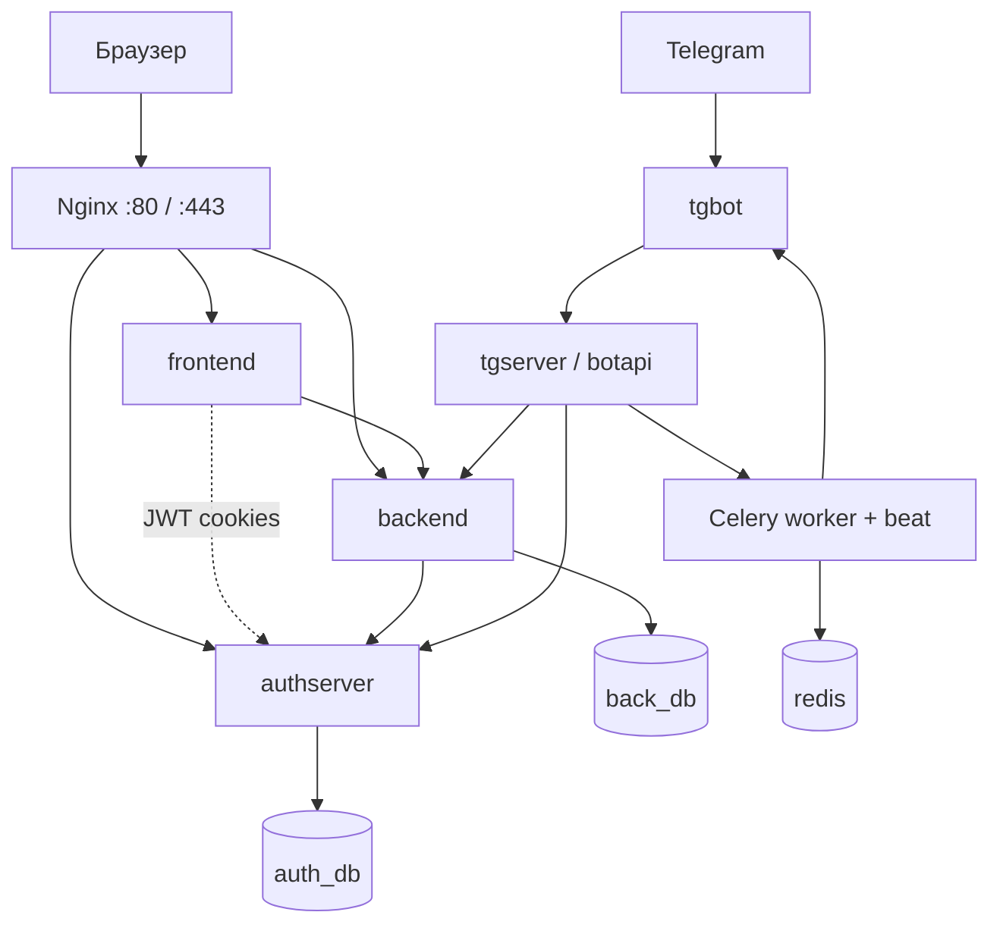

# Diary 2.0

Веб-дневник с иерархией папок, заметками, напоминаниями и интеграцией с Telegram. Проект развёрнут как набор микросервисов в Docker: отдельные сервисы аутентификации, бизнес-логики, UI, Telegram-бота и планировщика уведомлений.

---

## Возможности

- **Записи (records)** — папки, карточки записей, текстовые заметки и изображения внутри записи
- **Напоминания (notices)** — отдельное дерево папок, периодические напоминания (день / неделя / месяц / год), расчёт следующей даты срабатывания
- **Файловая система в UI** — drag-and-drop, смена порядка, перенос между папками
- **Аутентификация** — регистрация и вход, JWT в HttpOnly-cookies, refresh с ротацией и blacklist
- **Telegram** — привязка аккаунта к боту, создание напоминаний из чата, доставка по расписанию (Celery + Redis)
- **Часовые пояса** — напоминания хранятся в UTC, отображение и ввод — в timezone пользователя
- **Production-ready инфраструктура** — Nginx, HTTPS, Docker secrets, Gunicorn, PostgreSQL

---

## Архитектура

Ниже две схемы одного и того же: **Mermaid** (графика) и **ASCII** (текст).

**Mermaid** — разметка для диаграмм в Markdown. На [GitHub](https://github.com) и в предпросмотре Cursor/VS Code блок ниже отображается как рисунок. Если видите только код — откройте README на GitHub или включите Markdown Preview.

### Схема (Mermaid)



### Схема (ASCII)

Та же логика в текстовом виде — читается в любом редакторе без предпросмотра:

```
Браузер
   │
   ▼
 Nginx  :80 / :443
   ├── /              →  frontend      (HTML, статика)
   ├── /auth/         →  authserver    (регистрация, JWT)
   ├── /api/          →  backend       (записи, напоминания, медиа)
   ├── /static/       →  том static_volume
   └── /media/        →  _media/data

frontend  ──cookies JWT──►  authserver
frontend  ──REST──────────►  backend  ──verify/refresh──►  authserver

Telegram
   │
   ▼
 tgbot  ──►  tgserver (botapi)  ──►  backend, authserver
                  │
                  ├──  celery_worker / celery_beat
                  └──  redis

authserver  ──►  auth_db   (PostgreSQL)
backend     ──►  back_db   (PostgreSQL)
```

Через Nginx в браузере всё доступно с одного origin: `/` — UI, `/auth/` — auth API, `/api/` — backend API. Сервисы `bot` и `botapi` работают во внутренней сети Docker и напрямую не проксируются Nginx.

Внутренние вызовы между `back`, `authserver` и `botapi` защищены общим секретом `INTERNAL_SERVICE_TOKEN` (заголовок `X-Service-Token`). Публичный JWT для браузера с этим не связан.

### Сервисы

- **nginx**
  - Reverse proxy, раздача static/media, SSL. Порт: **80**, **443**.

- **front** (контейнер `diary_frontend`)
  - HTML-страницы и UI. Стек: Django 5, Gunicorn. Порт: **8000**.

- **authserver** (контейнер `diary_authserver`)
  - Регистрация, вход, JWT, привязка Telegram. Стек: Django 5, DRF, SimpleJWT. Порт: **8001**.

- **back** (контейнер `diary_backend`)
  - REST API записей, напоминаний и загрузки файлов. Стек: Django 5, DRF, Pillow. Порт: **8002**.

- **botapi** (сервис `botapi` в compose)
  - HTTP API для бота и Celery. Стек: FastAPI, Uvicorn. Порт: **8003**.

- **bot** (контейнер `diary_bot`)
  - Telegram-бот, общается с пользователем и tgserver. Стек: pyTelegramBotAPI. Порт наружу не пробрасывается.

- **celery_worker** / **celery_beat**
  - Планировщик и фоновая отправка напоминаний. Стек: Celery 5. Только внутренняя сеть Docker.

- **auth_db** / **back_db**
  - Две отдельные базы PostgreSQL 16 (пользователи и данные дневника). Только внутренняя сеть Docker.

- **redis**
  - Очередь и хранилище для tgserver/Celery. Redis 8. Только внутренняя сеть Docker.

---

## Стек технологий

- **Backend**: Python 3.12, Django 5.2, Django REST Framework
- **Auth**: djangorestframework-simplejwt, token blacklist
- **Telegram API**: FastAPI, aiohttp, Celery, Redis
- **Frontend**: Django templates, vanilla JavaScript
- **Инфраструктура**: Docker Compose, Docker secrets, Gunicorn, Nginx
- **БД**: PostgreSQL 16 (prod), SQLite (локальная разработка при `DEBUG=true`)

---

## Структура репозитория

```
.
├── frontend/          # UI (Django SSR)
├── authserver/        # Аутентификация и профиль пользователя
├── backend/           # Основной REST API и медиафайлы
├── tgserver/          # FastAPI + Celery для напоминаний
├── tgbot/             # Telegram-бот
├── nginx/             # Конфигурация reverse proxy
├── ssl-factory/       # Получение SSL-сертификатов Let's Encrypt (отдельно)
├── _auth_db/          # Секреты и данные PostgreSQL (auth)
├── _back_db/          # Секреты и данные PostgreSQL (backend)
├── _redis/            # Секреты и данные Redis
├── _media/            # Загруженные пользовательские файлы
├── docker-compose.yaml        # база: dev (HTTP, nginx local.conf)
├── docker-compose.prod.yaml   # override для production (HTTPS, nginx prod.conf + ssl)
├── docker-compose.test.yaml   # override для unit-тестов (make test)
├── Makefile                   # команды up / down / test
└── start-with-secrets.sh      # первый запуск: секреты + up (вызывается из make start)
```

---

## Требования

- [Docker](https://docs.docker.com/get-docker/) и Docker Compose v2
- **Bash** (для скриптов генерации секретов): **Git Bash** или **WSL** на Windows, обычный shell на 
Linux/macOS
- **Make** — для команд `make …`
- Для production с HTTPS: домен, указывающий на сервер, и настроенный [`ssl-factory`](ssl-factory/README.md)

> **Python и venv не нужны** для запуска приложения и тестов — всё выполняется в Docker. Файл `python-version.txt` (3.11) — ориентир без Docker; в образах используется Python 3.12 из `dockerfile.prod`.

---

## Быстрый старт (Docker)

### 1. Подготовить `.env` в каждом сервисе

Файлы `.env` **не коммитятся** (см. `.gitignore`). Перед первым запуском создайте их по шаблонам ниже. Скрипты `generate-secrets.sh` читают `.env` и формируют `*-secrets.txt` для Docker.

Минимальный набор каталогов с `.env`:

| Каталог | Файл секретов (генерируется) |
|---------|------------------------------|
| `_redis/` | `_redis/redis-secrets.txt` |
| `_auth_db/` | `_auth_db/authdb-secrets.txt` |
| `_back_db/` | `_back_db/backdb-secrets.txt` |
| `authserver/` | `authserver/authserver-secrets.txt` |
| `backend/` | `backend/backend-secrets.txt` |
| `frontend/` | `frontend/frontend-secrets.txt` |
| `tgbot/` | `tgbot/bot-secrets.txt` |
| `tgserver/` | `tgserver/tgserver-secrets.txt` |

**Общий секрет для микросервисов** — в `.env` трёх сервисов должен быть **один и тот же** `INTERNAL_SERVICE_TOKEN` (длинная случайная строка; для dev и prod — разные значения):

| Сервис | Нужен `INTERNAL_SERVICE_TOKEN` | Нужен `DEBUG` |
|--------|-------------------------------|---------------|
| `authserver/` | да | да |
| `backend/` | да | да |
| `tgserver/` | да | да |
| `frontend/`, `tgbot/` | нет | по необходимости |

### 2. Примеры `.env` для локальной разработки

**`_auth_db/.env`**

```env
POSTGRES_DB=diary_auth
POSTGRES_USER=diary_auth_user
POSTGRES_PASSWORD=change_me_strong_password
```

**`_back_db/.env`** — аналогично, свои `POSTGRES_*`.

**`_redis/.env`**

```env
REDIS_USER=diary_redis
```

**`authserver/.env`** (фрагмент; `SQL_PASSWORD` подставится из `_auth_db` при генерации)

```env
DEBUG=true
SSL=false
INTERNAL_SERVICE_TOKEN=change_me_same_in_backend_and_tgserver
DATABASE=postgres
DJANGO_ALLOWED_HOSTS=["localhost","127.0.0.1"]
CORS_ALLOWED_ORIGINS=["http://localhost","http://127.0.0.1"]
CORS_ALLOW_CREDENTIALS=true
ACCESS_TOKEN_LIFETIME=30
REFRESH_TOKEN_LIFETIME=10080
PROJECT_HOSTS={"frontend":"http://localhost/","auth_server":"http://authserver:8000/","backend":"http://back:8000/","tg_server":"http://botapi:8000/"}
SQL_ENGINE=django.db.backends.postgresql
SQL_DATABASE=diary_auth
SQL_USER=diary_auth_user
SQL_HOST=auth_db
SQL_PORT=5432
```

**`backend/.env`** — те же `DEBUG`, `SSL`, `INTERNAL_SERVICE_TOKEN` (как в authserver), `CORS_*`, `PROJECT_HOSTS`, токены; `SQL_*` указывают на `back_db` и свою БД.

**`frontend/.env`**

```env
DEBUG=true
SSL=false
SINGLE_USER=false
DJANGO_ALLOWED_HOSTS=["localhost","127.0.0.1"]
ACCESS_TOKEN_LIFETIME=30
REFRESH_TOKEN_LIFETIME=10080
PROJECT_HOSTS={"frontend":"http://localhost/","auth_server":"http://authserver:8000/","backend":"http://back:8000/","tg_server":"http://botapi:8000/"}
```

**`tgbot/.env`**

```env
TOKEN=your_telegram_bot_token
ID=your_telegram_user_id
SITELINK=http://localhost/
PROJECT_HOSTS={"tg_server":"http://botapi:8000/"}
DEBUG=true
```

**`tgserver/.env`**

```env
DEBUG=true
INTERNAL_SERVICE_TOKEN=change_me_same_in_authserver_and_backend
PROJECT_HOSTS={"backend":"http://back:8000/","auth_server":"http://authserver:8000/","tg_server":"http://botapi:8000/"}
TGTOKEN=your_telegram_bot_token
MY_TG_ID=your_telegram_user_id
REDIS_WORKS=true
REDIS_HOST=redis
REDIS_PORT=6379
REDIS_USER=diary_redis
REDIS_USER_PASSWORD=will_be_overwritten_from_redis_secrets
```

JSON в `PROJECT_HOSTS` и списках хостов должен быть **валидным** (двойные кавычки, без лишних запятых).

### 3. Запуск

**Рекомендуется — Make (Git Bash / WSL / Linux / macOS):**

```bash
make start    # первый раз: секреты + сборка + up
make up       # поднять стек (секреты уже должны быть)
make help     # все команды
```

**Вариант A — скрипт (Linux / WSL / Git Bash) (то же, что `make start`):**

```bash
chmod +x start-with-secrets.sh */generate-secrets.sh _*/generate-secrets.sh
./start-with-secrets.sh
```

Скрипт: останавливает старые контейнеры → генерирует все `*-secrets.txt` → `docker compose up -d` → настраивает права на `_media/data` (нужен `sudo` на Linux).

**Вариант B — вручную:**

```bash
make secrets
docker compose up -d --build
```

или

```bash
cd _redis && ./generate-secrets.sh && cd ..
cd _auth_db && ./generate-secrets.sh && cd ..
cd _back_db && ./generate-secrets.sh && cd ..
cd authserver && ./generate-secrets.sh && cd ..
cd backend && ./generate-secrets.sh && cd ..
cd frontend && ./generate-secrets.sh && cd ..
cd tgbot && ./generate-secrets.sh && cd ..
cd tgserver && ./generate-secrets.sh && cd ..

docker compose up -d --build
```

### 4. Открыть приложение

| Режим | URL | Compose |
|-------|-----|---------|
| Локально (HTTP) | http://localhost | `docker-compose.yaml` — `make up` |
| Production (HTTPS) | https://your-domain.com | `+ docker-compose.prod.yaml` — `make up-prod` |

Nginx: dev — `nginx/conf.d/local.conf`, prod — `nginx/conf.d/prod.conf` + `nginx/ssl/` (подключается через prod-override, в базовом compose переключать вручную не нужно).

Прямой доступ к сервисам (без Nginx): frontend `:8000`, auth `:8001`, backend `:8002`, tgserver `:8003`.

### 5. Первый пользователь

1. Открыть http://localhost/registration  
2. Зарегистрировать аккаунт (при регистрации на backend создаются корневые папки `root`)  
3. Войти через http://localhost/login  

Для Telegram: в настройках приложения запустить привязку бота (flow `tg-auth/*` на authserver).

---

## Управление проектом (Make)

Все команды выполняются **из корня репозитория** в Git Bash (или WSL / Linux / macOS):

```bash
make help
```

| Команда | Действие |
|---------|----------|
| `make start` | Первый запуск (dev): генерация секретов, сборка, `up -d` |
| `make secrets` | Только перегенерировать `*-secrets.txt` |
| `make up` | Поднять **dev**-стек (HTTP) |
| `make up-build` | Поднять dev-стек с пересборкой образов |
| `make up-prod` | Поднять **prod**-стек (HTTPS) |
| `make up-build-prod` | Поднять prod-стек с пересборкой образов |
| `make down` | Остановить dev-стек |
| `make down-prod` | Остановить prod-стек |
| `make restart` | Перезапустить dev-стек |
| `make restart-prod` | Перезапустить prod-стек |
| `make ps` | Статус dev-контейнеров |
| `make ps-prod` | Статус prod-контейнеров |
| `make logs` | Логи dev-стека (follow) |
| `make logs SERVICES="bot botapi"` | Логи выбранных сервисов |
| `make test` | Unit-тесты всех сервисов (back, authserver, front, botapi, bot) |
| `make test SERVICES="bot botapi"` | Тесты выбранных сервисов |

Тесты используют `docker-compose.test.yaml` (override к основному compose), проект Docker `-p diary-tests` — **работающий стек не затрагивается**. Redis и PostgreSQL для unit-тестов не поднимаются.

Пересборка образа одного сервиса после изменения кода:

```bash
docker compose build botapi && make up
```

---

## API (кратко)

Префиксы через Nginx:

| Префикс | Сервис | Примеры |
|---------|--------|---------|
| `/auth/` | authserver | `registration`, `obtain`, `refresh`, `logout`, `verify` |
| `/api/` | backend | `file-system/record-content/`, `records/`, `file-system/notice-content/`, `notices/` |

Аутентификация в браузере: JWT в cookies `access_token` / `refresh_token` (HttpOnly). Backend проверяет токены через authserver (`AuthMiddleware`).

---

## Тесты

Тесты запускаются автоматически в CI.

Unit-тесты запускаются **в Docker**, без venv:

```bash
make test                        # все сервисы
make test SERVICES="bot"         # один сервис
make test SERVICES="bot botapi"  # несколько
```

Конфигурация — `docker-compose.test.yaml` (переменные окружения как в CI, см. `.github/workflows/ci-cd.yml`). Исходники монтируются volume-ом: после правок тестов пересборка не нужна, достаточно снова `make test`.

Ключевая бизнес-логика дат напоминаний покрыта в backend:

```bash
make test SERVICES="back"
# внутри контейнера это manage.py test (в т.ч. main.tests.TestOfTestDateAPI)
```

Ручной запуск тестов определения дат:
```bash
docker compose -p diary-tests -f docker-compose.yaml -f docker-compose.test.yaml run --rm --no-deps back python3 manage.py test main.tests.TestOfTestDateAPI
```

---

## Production и SSL

1. В `nginx/conf.d/prod.conf` заменить `server_name` на нужный домен.  
2. Получить сертификаты через [`ssl-factory`](ssl-factory/README.md) и положить `cert.pem` / `key.pem` в `nginx/ssl/`.  
3. В `.env` сервисов: `DEBUG=false`, `SSL=true`, актуальные `DJANGO_ALLOWED_HOSTS` и `CORS_ALLOWED_ORIGINS`; **один prod-`INTERNAL_SERVICE_TOKEN`** в `authserver`, `backend`, `tgserver`.  
4. Перегенерировать секреты (`make secrets`) и поднять стек: **`make up-build-prod`** (или `docker compose -f docker-compose.yaml -f docker-compose.prod.yaml up -d --build`).

Деплой по push в `master` (CI) использует тот же prod-override в `.github/deploy_ssh.sh`.

Подробности обновления сертификатов без простоя — в `ssl-factory/README.md`.

---

## Безопасность

- Не коммитим `*.env`, `*-secrets.txt`, `credentials.txt`, токены бота и пароли БД.  
- Файлы `*-secrets.txt` и `credentials.txt` в `.gitignore`.  
- В production: `DEBUG=false`, `SSL=true` — тестовые API (`/api/tests/`, `set-test/`, тестовые маршруты tgserver) не регистрируются.  
- Внутренние эндпоинты (`api/tg-server/*`, `api/auth/create-roots/`, часть `auth/users/*`, `tgapi/set-notice-list/`) требуют заголовок `X-Service-Token` с `INTERNAL_SERVICE_TOKEN`.  

---

## Автор

Пет-проект для демонстрации backend-разработки: микросервисы, JWT, Docker, PostgreSQL, Celery, Telegram API, работа с timezone и периодическими задачами.
